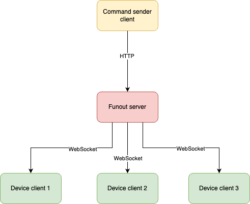

# Description

A simple implementation of a concurrent broadcast server that dispatches a message to the connected clients via the websocket protocol.
ALso, the server has HTTP endpoint to receive a message and sends it out to all  (or selected) clients.

# Prerequisites:

One need to have Docker installer.

# Architecture 


# Startup instructions:

## 1. Build source code to docker image:

```bash
sh 1_build.sh
```

## 2. Run server (image in docker)

```bash
sh 2_run_server.sh
```

## 3. Run 3 clients 

```bash
sh 3_run_client_1.sh
```

```bash
sh 3_run_client_2.sh
```

```bash
sh 3_run_client_3.sh
```

## 4. Test using HTTP

Send message to the first device:
```bash
sh 4_test_http_1.sh
```

Send message to all devices:
```bash
sh 4_test_http_2.sh
```


# Explanations:

1. Main processing code is located in file [devices_storage.go](internal%2Fstorage%2Fdevices_storage.go), more precosely, in the source code:
```go
func (ds *DeviceStorage) Start(ctx context.Context) {
	func() {
		for {
			select {
			case <-ctx.Done():
				ds.logger.Debug("shutting down storage... # of devices+", len(ds.devices))

				for _, d := range ds.devices {
					ds.logger.Debug("closed devices connection #", d.Id)

					if err := d.Disconnect(); err != nil {
						ds.logger.Warn("error closing device connection: ", err)
					}
				}
				return
			case msg := <-ds.dispatch:
				if msg.DeviceID == nil {
					ds.logger.Debug(fmt.Sprintf("broadcast dto: %+v", msg))
					ds.broadcast(msg)
				} else {
					ds.logger.Debug(fmt.Sprintf("sending to one device, dto: %+v", msg))
					ds.sendToDevice(*msg.DeviceID, msg)
				}
			case device := <-ds.store:
				ds.devices[device.Id] = device
			case deviceId := <-ds.delete:
				delete(ds.devices, deviceId)
			}
		}
	}()
}
```

2. Please do not pay much attention to `server` [listener.go](internal%2Fserver%2Flistener.go), it's quite complex implementation from my latest experience.

3. 